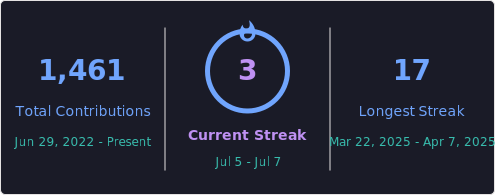

###

# Hello and welcome to my profile section 

###

<h3 align="left">👨‍💻 About Me</h3>

🌐 My Portfolio : <strong><a href="https://takieddine.me" target="_blank" rel="noopener noreferrer">takieddine.me</a></strong>

  I am a <strong>Master's Student in AI & Data Science</strong> passionate about turning raw data into intelligent solutions. With hands-on experience in Machine Learning, Deep Learning, NLP, and Big Data, I enjoy tackling real-world challenges and building end-to-end data-driven systems.

<ul>
  <li>🤖 Currently building projects in <strong>Deep Learning, NLP, Big Data pipelines</strong> and <strong>LLM integration</strong> — including real-time sentiment analysis, automatic sign language translation, and AutoML platforms.</li>
    <li>🌱 Former Full Stack MEAN Developer — experienced with end-to-end deployment, REST APIs, and AI chatbot integration at <a href="https://www.linkedin.com/company/smart-automation-technologies" target="_blank" rel="noopener noreferrer">SAT</a>, and having crafted custom Angular UI experiences at <a href="https://avatechtools.com" target="_blank" rel="noopener noreferrer">Avatech Tools</a>.</li>

📫 Let's connect and build something intelligent! 

###

<h3 align="left">
  
  Language and tools
</h3>

###

  <!-- Frontend -->
  
  
  
  
  
  
  
  
  
  
  
  
  
  
  
  
  
  
  
  
  
  
  
  

  <!-- Backend -->
  
  
  
  
  
  
  
  
  
  

  <!-- Databases -->
  
  
  
  
  
  
  
  

  <!-- Programming Languages -->
  
  
  
  
  
  
  
  

  <!-- Tools & DevOps -->
  
  
  
  
  
  
  
  
  
  
  
  
  
  

  <!-- Design / 3D -->
  
  
  

###

<h3 align="left">🔥   My Stats :</h3>

###
 

    
     <!-- src="https://github-profile-summary-cards.vercel.app/api/cards/repos-per-language?username=Taki-eddine-El-Attari&theme=tokyonight" -->

###
<picture>
  <source media="(prefers-color-scheme: dark)" srcset="https://raw.githubusercontent.com/Taki-eddine-El-Attari/Taki-eddine-El-Attari/output/github-snake-dark.svg" />
  <source media="(prefers-color-scheme: light)" srcset="https://raw.githubusercontent.com/Taki-eddine-El-Attari/Taki-eddine-El-Attari/output/github-snake.svg" />
  
</picture>

